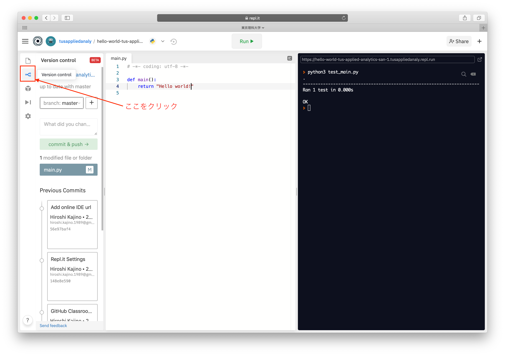

# GitHub Classroom を用いた課題のはじめかた
このページでは GitHub Classroom を用いて課題をやるための手順を紹介します。

## 課題の取得
ここでは Github Classroom で提供している課題を取得するまでの手順を紹介します。
まずはじめに LETUS で提供される URL にいくと、以下の画面が出てきます。

"Accept this assignment" をクリックすると課題の読み込みが始まり、以下の画面まで遷移します。
下図の赤い四角で囲ってあるURLが自分の課題のあるURLになります（それぞれの学生で異なるURLとなります）

上記URLにいくと下図のような画面に遷移します。ここに自分の課題ファイルが置かれています。
下図の赤い四角で囲った "Work in Repl.it" をクリックすると、課題を解く環境へ遷移します。

## Repl.it の操作方法
ここでは Repl.it での課題の取り組み方と課題提出方法を紹介します。

"Work in Repl.it" を開くと下図のような画面に移ります。
左の Files のカラムには課題で必要なファイルが表示されています。
はじめの状態では `README.md` が表示されています（中央部）。
`README.md` には課題の内容が記載されているので、課題の内容を把握したい場合にはこのファイルを参照ください。
一番右のカラム（黒背景）にはコンソール画面が表示されています。プログラムの実行結果などが表示されます。

## Hello world 課題を例にした課題の取り組み方
`main.py` を開いてみます。真ん中の画面が切り替わり、下図のように `main.py` の中身が表示されるようになります。
ほとんどの課題はこのファイルの中身を書くことになります。

Hello world の課題では、 "Hello!" と書かれている箇所を "Hello world!" と書き換えることが課題となっています。
つまり下図のような状態にすることが課題を解くことです（今の時点では何をしているのかを理解できてなくても大丈夫です）。

これで正しく課題が解けているのか、まずは手元で判定します。
上にある "Run▶︎" というボタンを押すと判定を行うことができます。
正しくできている場合、下図のように OK というメッセージが右のコンソール（黒背景）に出ます。
右下の赤いメッセージボックスは気にしなくて大丈夫です。

正しくできていない場合は下図のように FAILED というメッセージが出ます。

## 解答の提出方法
正しく課題が解けていることを確認したら、最後にプログラムを提出します。提出しなかった場合、教員側はプログラムを見ることができないため採点対象外となるのでご注意ください。
課題提出のためにまず下図のボタンを押して Version control の画面に移ります。

赤く囲ったテキストボックス（下図では first submission と書いてある箇所）に、適当な文言を記入します（なんでも大丈夫です）。
次にその "commit & push" というボタンを押します。これで提出完了です。
何か変更をしたくなった場合は、以上の作業を繰り返すことで課題の再提出ができます。

最後に、課題が正しく提出されたか＆正しく評価されたか確認をします。
はじめに下図の赤枠で囲った部分をクリックし GitHub に戻ります。

下図の赤枠で採点結果を見ることができます。
下図ではオレンジ色の丸のマークと "14 seconds ago" という文言が書いてあるのですが、オレンジ色のマークは採点途中を示していて、 "14 seconds ago" は 14 秒前に課題が提出されたことを表しています。

少し時間が経った後リロードすると採点結果を見ることができます。
下図の緑のチェックマークは、（採点の範囲内で）正しく解答できたことを表しています。

注）本講義で採用している採点方式は、正しくない解答でも正しいと判定してしまう可能性があります。目視によるチェックで不正解であると判定された場合は個別に連絡する可能性があります。
また採点に関するプログラム（各課題で明示します）を操作して不正にテスト合格をした場合はカンニングと見なし、本講義を含む学期全ての講義の単位が与えられない可能性があります。

# 課題を再開したいとき

いくつか方法があります。

1. LETUSで提供している課題の招待URLにいくとその課題にアクセスすることができます。
1. GitHub の[このページ](https://github.com/tus-applied-analytics) にいくとこれまで取り組んだ課題の一覧が表示されます。ここから再開したい課題を選んでください。
1. [Repl.it](https://repl.it/) にアクセスします。左のタスクバーの "My Repls" をクリックするとこれまで取り組んだ課題一覧が出てきます。ここから再開したい課題を選んでください。
