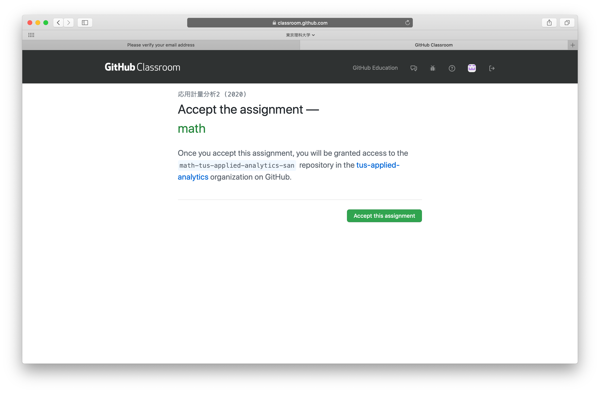

本講義では GitHub Classroom を活用してプログラミングの理解度チェックを行います。その際に以下のツールを利用します:

1. GitHub: ソフトウェア開発プラットフォーム
2. GitHub Classroom: プログラミング授業の支援プラットフォーム
3. Repl.it: ブラウザ上で動くプログラミング環境

本稿では GitHub のアカウントを作り、そのアカウントと GitHub Classroom, Repl.it とを連携させプログラミング演習を行う準備を整えることを目標とします。

# GitHub のアカウント
## すでにアカウントを持っている場合
もし大学のメールアドレス以外でアカウントを取得した場合は、大学のメールアドレスを自分のアカウントに紐づけてください（紐づいていない場合、成績評価ができません）。
GitHub のSetting > Emails でメールアドレスの追加ができます。

## アカウントを持っていない場合
GitHub のアカウントを持っていない場合、 GitHub のアカウントの作成が必要となります。
LETUS で提供されている課題招待URLにアクセスすると、以下の画面が表示されますがそこで "Create an account" をクリックします。

下図のようなアカウント作成ページに遷移します。必要項目を記入しパズルを解くと、入力したメール宛にアカウント作成確認メール (Please verify your email address というタイトル) が送られます。
そのメールで "Verify email address" をクリックすることでアカウント作成が完了します。

# GitHub のアカウントと GitHub Classroom の紐付け
ここまでで、大学のメールアドレスに紐づいた GitHub のアカウントを作成することができました。
ここではその GitHub アカウントと本講義の GitHub Classroom とを紐づけます。

先ほどと同様にLETUS で提供されている課題招待URLにアクセスします。GitHub にログインしていない場合はログインしてください。
下図のように、 "Authorize GitHub Classroom" という画面が出てくるので、 "Authorize github" をクリックします。
すると GitHub Classroom を使えるようになります。

また下図のように課題をやるかどうか聞かれるので "Accept this assignment" をクリックします。
色々画面が切り替わった挙句 You're ready to go! という画面に遷移し、各々専用の課題ページが作成されます。

その課題ページに飛んで下図のような画面になれば、 GitHub Classroom との連携ができたことになります。
途中 "GitHub Classroom is requesting additional permissions" という画面が出ることがありますが、 "Authorize github" を押して次に進めてください。

# repl.it のセットアップ
ここまでで GitHub Classroom を使うことができるようになりました。
以降、 repl.it を用いて課題に取り組む環境を整える方法を紹介します。

まずはじめに下図の画面の "Work in Repl.it" をクリックします。

すると下図のように repl.it が開き、 GitHub でログインするように促す画面が出てきます。
"Sign in with Github" をクリックします。

すると下図のように GitHub に戻り、 repl.it の利用を許可するかどうかを尋ねる画面が出てくるので、 "Install & Authorize" をクリックします。

最終的に以下のような画面に遷移すれば成功です。

もし上図の画面に遷移しない場合は、 [repl.it](https://repl.it) に行き "Log in" のボタンをを押してログインを試みてください。

下図の赤枠をクリックすると GitHub を経由したログインができます。ログイン後、課題ホームの "Work in Repl.it" をクリックすると
その課題を repl.it で開くことができるようになると思います。

## repl.it の設定
最後に repl.it の設定をします。
まず左のカラムの歯車マークをクリックします（下図参照）。

次に下図の赤枠のように Indent size を選択し、4に設定します。

これで repl.it の必要な設定は完了しました。
