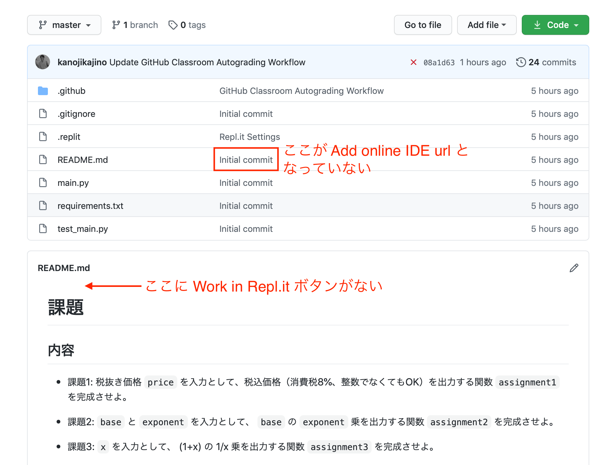
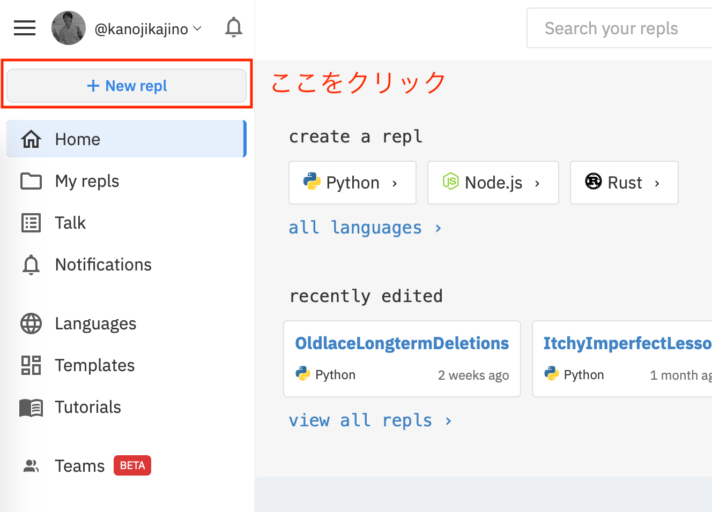
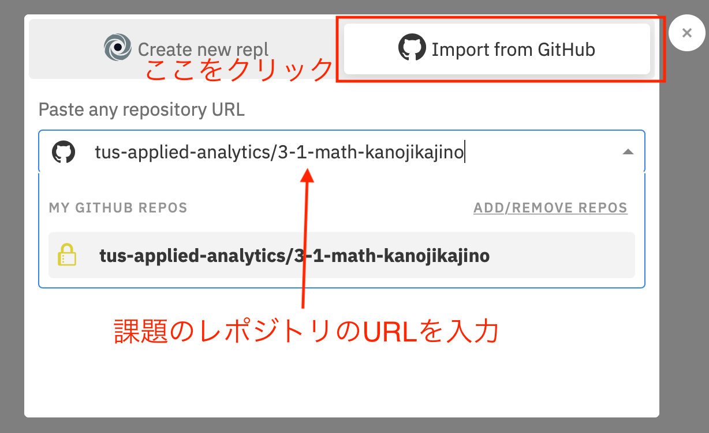

## Q1. 課題をアクセプトした後に表示されるレポジトリの画面で Repl.it のボタンがない

A1. 以下の画像のような状況でしょうか？

その特徴としては
- `Work in Repl.it` というボタンがない
- `README.md` の横の説明が `Add online IDE url` ではなく `Initial commit` など別の説明となっている
ことが挙げられます。

これは GitHub Classroom のバグです。このような状況になってしまった時に Repl.it で課題を開く方法を説明します。

1. [Repl.it](https://repl.it) にアクセスして GitHub アカウントでログインする（ログイン時に GitHub のロゴマークをクリックする）
1. `New repl` と書いてあるボタンを押す

1. `Import from GitHub` と書いてあるボタンを押す
1. テキストボックスにレポジトリの URL をペーストし、 `Import from GitHub` をクリックする

