# GitHub Classroom を用いた課題のはじめかた
このページでは GitHub Classroom を用いて課題をやるための手順を紹介します。

## 課題の取得
ここでは Github Classroom で提供している課題を取得するまでの手順を紹介します。
まずはじめに LETUS で提供される URL にいくと、以下の画面が出てきます。
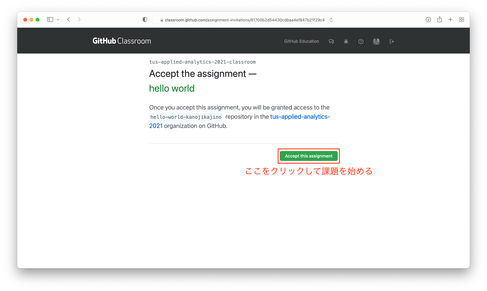

"Accept this assignment" をクリックすると課題の読み込みが始まり以下の画面に遷移します。
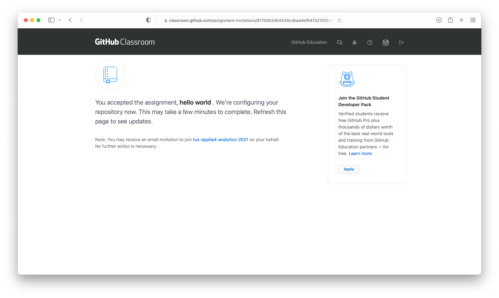

リロードをすると以下の画面に遷移します。
下図の赤い四角で囲ってあるところをクリックすると VSCode で課題が開きます。
またその上に記載されているURLが自分の課題のあるURLになります（それぞれの学生で異なるURLとなります）。
__準備段階でこのボタンが機能しなかった場合は、その時と同じように課題をダウンロードしてください。__
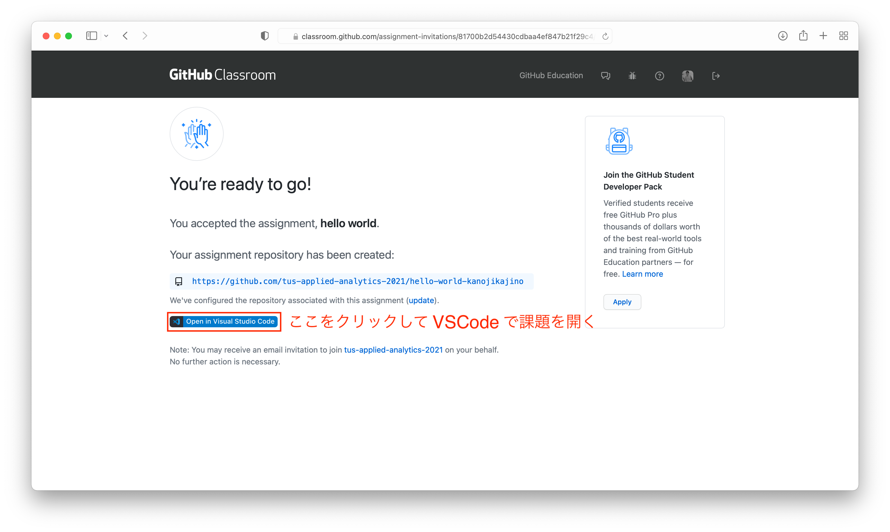

## VSCode の操作方法
ここでは VSCode での課題の取り組み方と課題提出方法を紹介します。

"Open in Visual Studio Code" を開くと Visual Studio Code が開き、(Macの場合)下図のような画面に移ります。 Open を選びます。
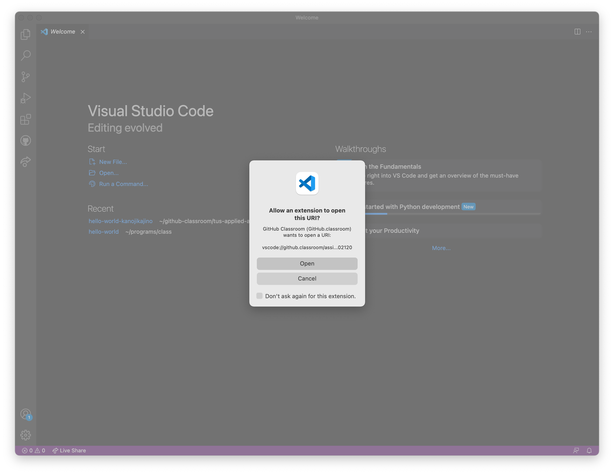

以下ような画面に遷移しない場合はもう一度 "Open in Visual Studio Code" を押してみてください。
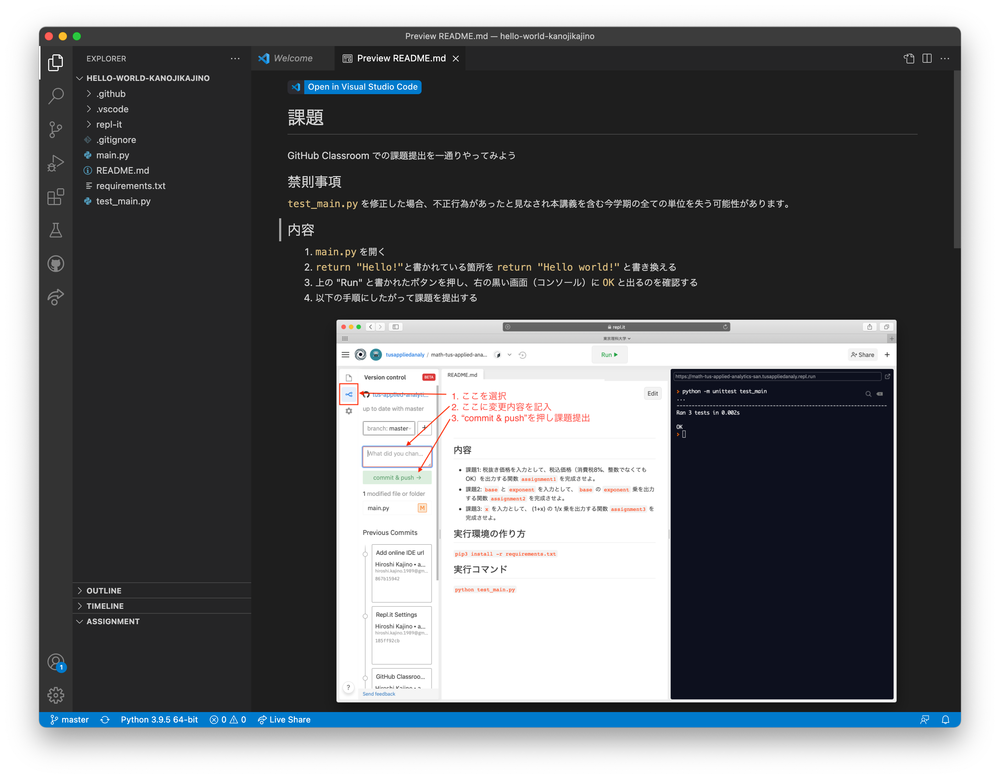

左のカラムには課題で必要なファイルが表示されています。
はじめの状態では `README.md` が表示されています（今年度の課題とは違う画像であることに注意してください）。
`README.md` には課題の内容が記載されているので、課題の内容を把握したい場合にはこのファイルを参照ください。

## Hello world 課題を例にした課題の取り組み方
左のファイルのリストから `main.py` をクリックして開いてみます。画面が切り替わり、下図のように `main.py` の中身が表示されるようになります。
ほとんどの課題はこのファイルの中身を埋める、または改変する課題となります。
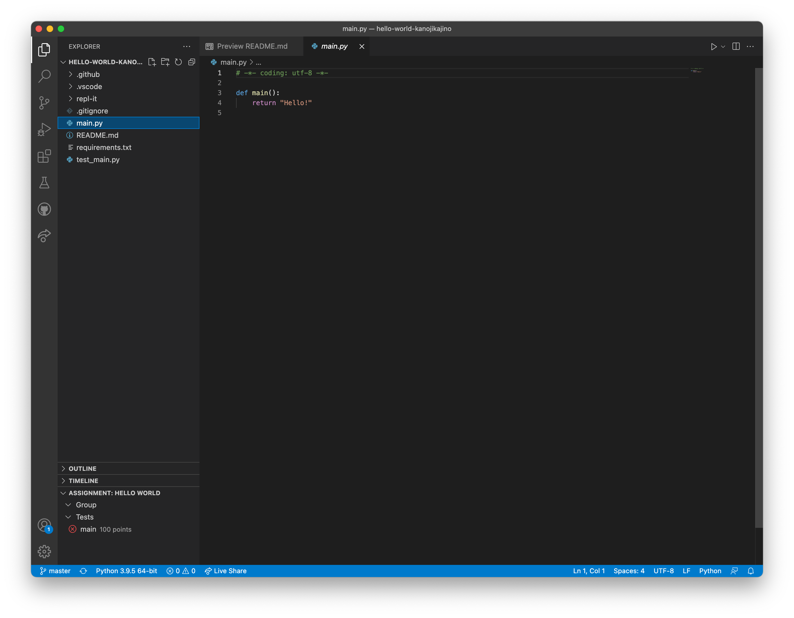

Hello world の課題では、 "Hello!" と書かれている箇所を "Hello world!" と書き換えて保存することが課題となっています。
つまり下図のような状態にすることが課題を解くことです（今の時点では何をしているのかを理解できてなくても大丈夫です）。
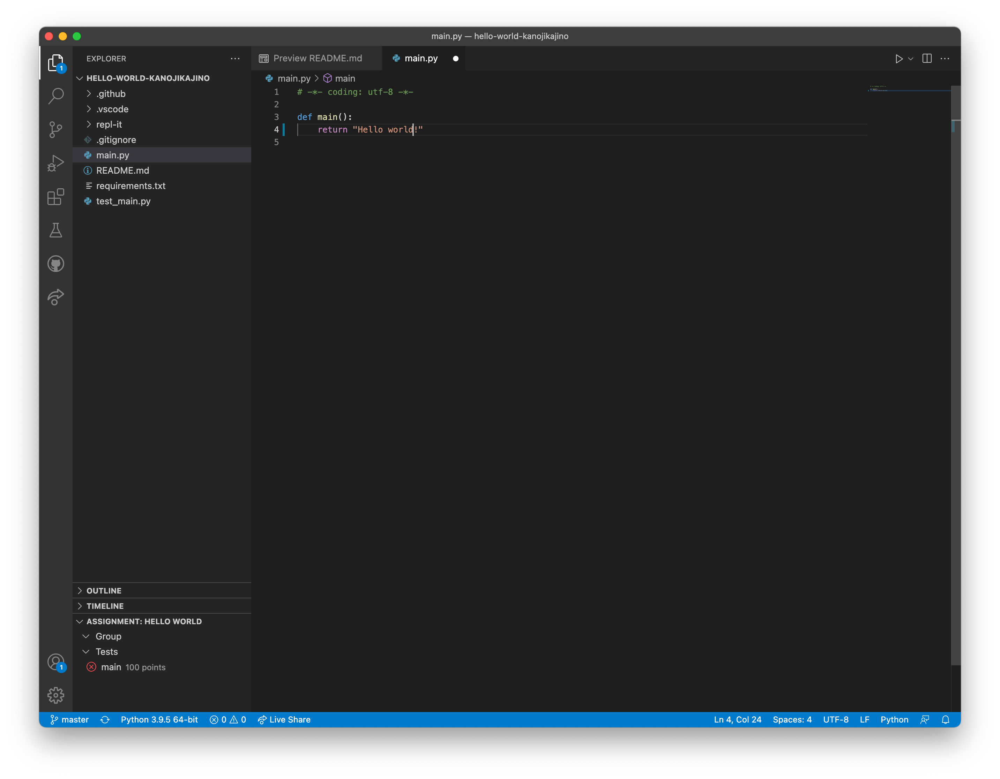

これで正しく課題が解けているのか、まずは手元で判定します。
下図にしたがってテストの画面を開き、テストを走らせます。
ここでテストとは、プログラムの正しさを判断するプログラムのことを指し、私が用意したものになります。
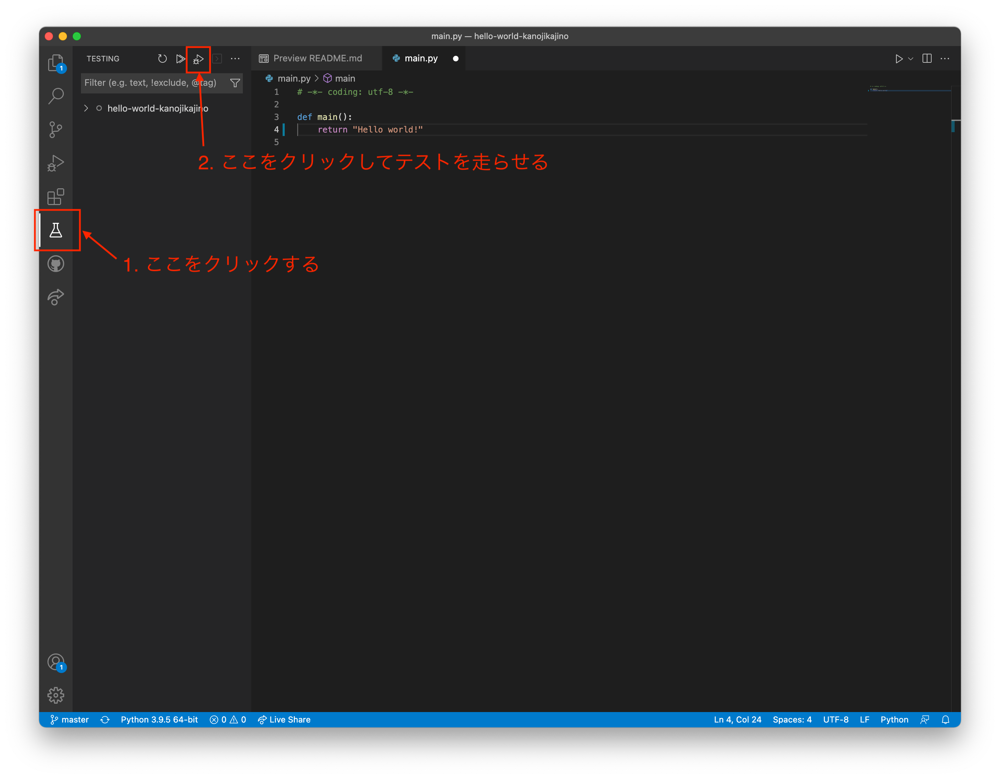

正しくできている場合は下図のように OK で終わります。
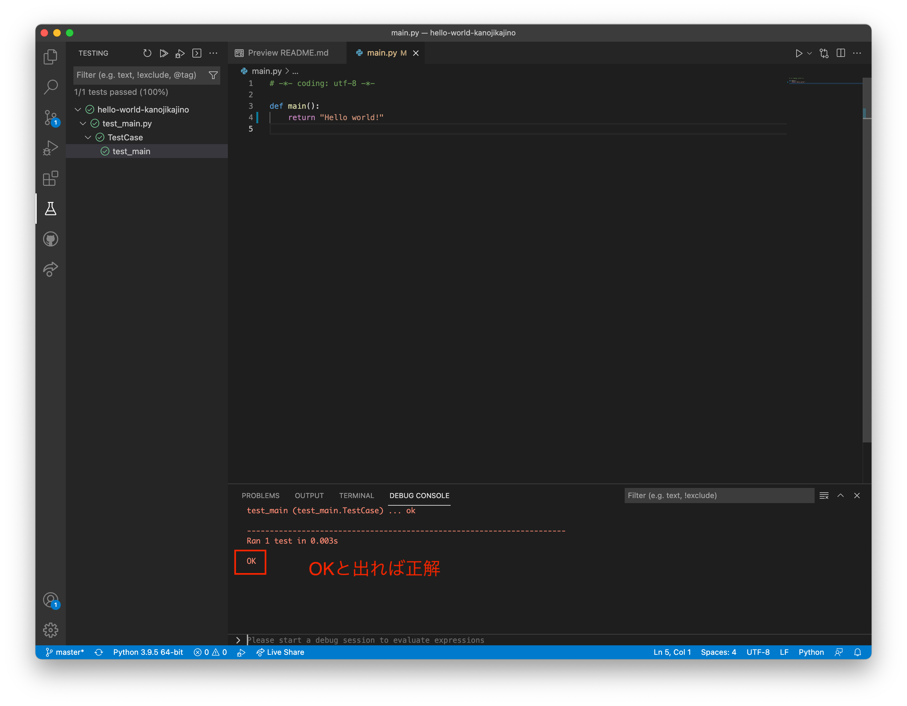

正しくできていない場合は下図のように FAILED というメッセージが出ます。
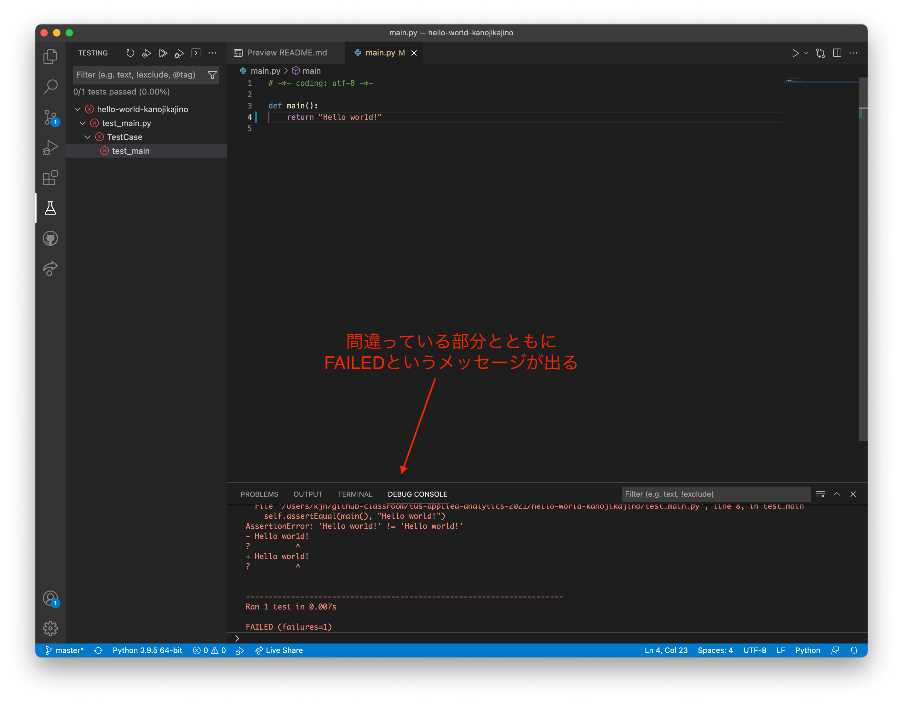

## 解答の提出方法
正しく課題が解けていることを確認したら、最後にプログラムを提出します。提出しなかった場合、教員側はプログラムを見ることができないため採点対象外となるのでご注意ください。
課題提出のためにまず下図のボタンを押して Version control の画面に移ります。
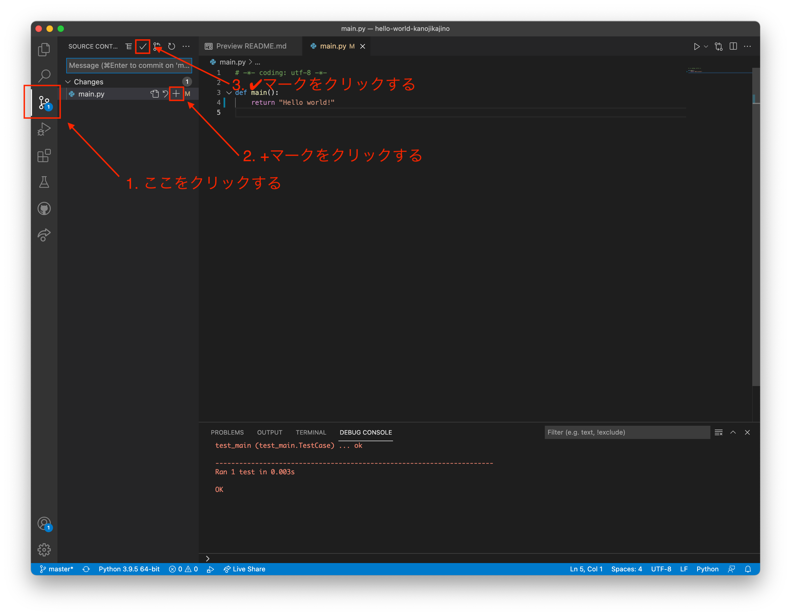

赤く囲ったテキストボックス（下図では first submission と書いてある箇所）に、適当な文言を記入します（なんでも大丈夫です）。
次にその "commit & push" というボタンを押します。これで提出完了です。
何か変更をしたくなった場合は、以上の作業を繰り返すことで課題の再提出ができます。
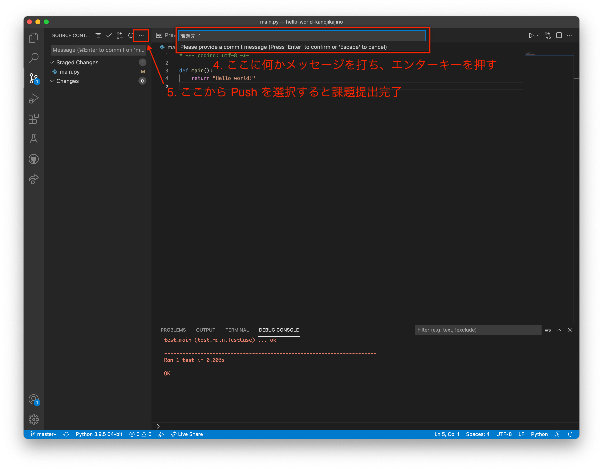

最後に、課題が正しく提出されたか＆正しく評価されたか確認をします。
まず課題URLから Github のページを開きます（上の方で VSCode で課題を開くステップで出てきたURLを使います）。
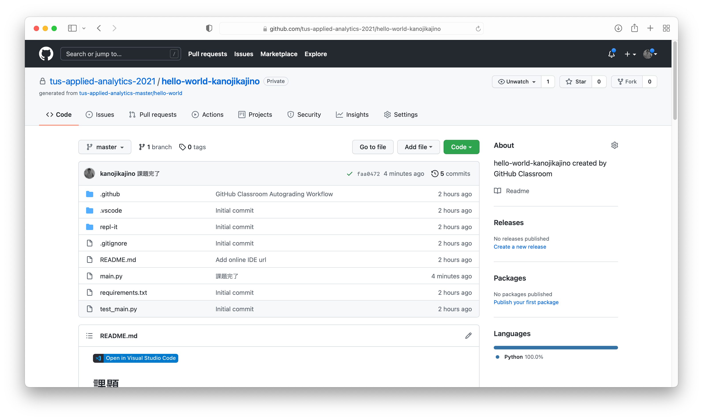

下図の赤枠で採点結果を見ることができます。
下図ではオレンジ色の丸のマークと "14 seconds ago" という文言が書いてあるのですが、オレンジ色のマークは採点途中を示していて、 "14 seconds ago" は 14 秒前に課題が提出されたことを表しています。
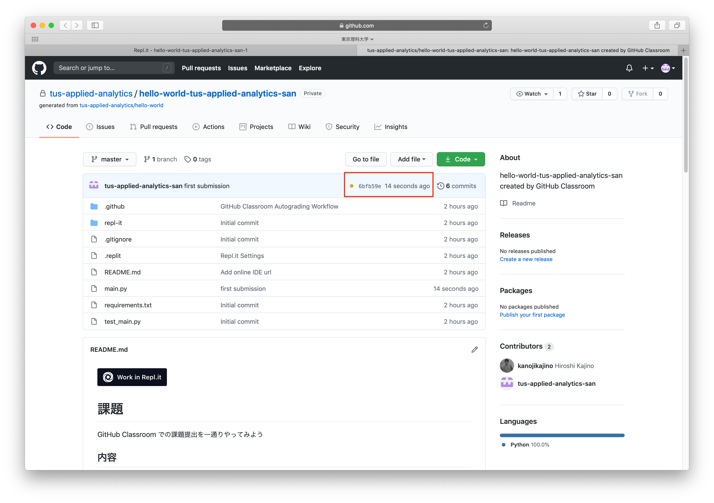

少し時間が経った後リロードすると採点結果を見ることができます。
下図の緑のチェックマークは、（採点の範囲内で）正しく解答できたことを表しています。

注）本講義で採用している採点方式は、正しくない解答でも正しいと判定してしまう可能性があります。目視によるチェックで不正解であると判定された場合は個別に連絡する可能性があります。
また採点に関するプログラム（各課題で明示します）を操作して不正にテスト合格をした場合はカンニングと見なし、本講義を含む学期全ての講義の単位が与えられない可能性があります。

# 課題を再開したいとき

いくつか方法があります。

1. LETUSで提供している課題の招待URLにいくとその課題にアクセスすることができます。
1. Visual Studio Code の「最近開いたファイル」から課題を開きます
1. ホームディレクトリ以下に `github-classroom` といった名前のディレクトリができていると思います。その中にそれぞれの課題フォルダがあるので、それを Visual Studio Code で開きます。
