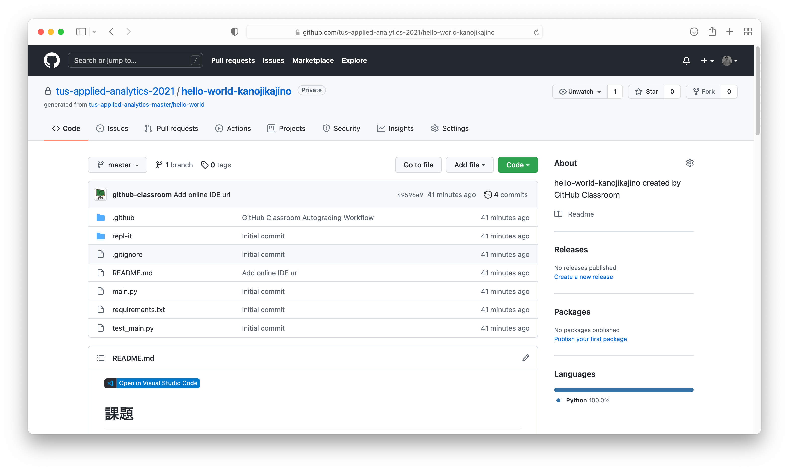
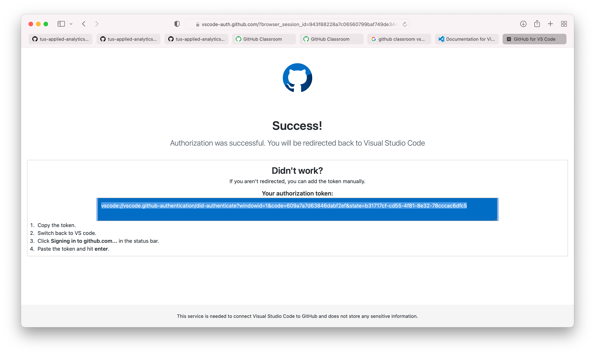

本講義では GitHub Classroom を活用してプログラミングの理解度チェックを行います。その際に以下のツールを利用します:

1. Python: プログラミング言語
1. Git: プログラムのバージョン管理ツール
1. GitHub: ソフトウェア開発プラットフォーム
1. GitHub Classroom: プログラミング授業の支援プラットフォーム
1. Visual Studio Code (VSCode: プログラミングを行うためのソフトウェア

本稿では VSCode をインストールし、 GitHub のアカウントを作り、そのアカウントと GitHub Classroom とを連携させプログラミング演習を行う準備を整えることを目標とします。

# Python のセットアップ
- https://www.python.org/ の Downloads から最新版をダウンロードする（2021/10/7時点では3.10.0）
- Windows の場合、インストール時に "Add Python 3.10 to PATH" にチェックマークをつける


# Git のセットアップ
- https://git-scm.com の Downloads から自分のOSに合わせてダウンロードする
- 標準でインストールして大丈夫だと思います

# VSCode のセットアップ

- Visual Studio Code のWebページを開く [https://code.visualstudio.com](https://code.visualstudio.com)
- サイトの右上にダウンロードページへのリンクがあるのでそれを開き、自分の使っているパソコンのOSに合わせてダウンロード・インストールを行う
- 最後にVSCode上でGitを使うための設定をします。まずVSCode を起動し、上のメニューバーから Terminal > New Terminal を選択し、ターミナルを起動する（ターミナルとは文字ベースでパソコンを操作するための機能です）

- 下の図のように
```bash
git config --global user.name "自分の名前"
```
と打ち、エンターを押し、
```bash
git config --global user.email "自分のメールアドレス"
```
と打ち、エンターを押す。ここで "自分の名前"、 "自分のメールアドレス" はそれぞれ自分の名前とアドレスに変更してください。私の場合は下図を参照ください。


- 次に `numpy` をインストールする。同じくターミナルに
```bash
pip install numpy
```
もしくは
```bash
python -m pip install numpy
```
と打ち、エンターを押し、インストールが完了した旨のメッセージが出れば成功。

エラーが出る場合、[このページ](https://www.out48.com/archives/5720/)のように
Windowsの設定 >  アプリと機能 >  アプリ実行エイリアスと辿って、
python.exe と python3.exe をオフにしてから再度インストールしてみてください。


# GitHub のアカウント（アカウントを持っていない場合）
GitHub のアカウントを持っていない場合、 GitHub のアカウントの作成が必要となります。
LETUS で提供されている課題招待URLにアクセスすると、以下の画面が表示されますがそこで "Create an account" をクリックします。


下図のようなアカウント作成ページに遷移します。必要項目を記入しパズルを解くと、入力したメール宛にアカウント作成確認メール (Please verify your email address というタイトル) が送られます。
そのメールで "Verify email address" をクリックすることでアカウント作成が完了します。


# GitHub のアカウントと GitHub Classroom の紐付け
次に GitHub アカウントと本講義の GitHub Classroom とを紐づけます。

先ほどと同様にLETUS で提供されている課題招待URLにアクセスします。GitHub にログインしていない場合はログインしてください。
下図のように、 "Authorize GitHub Classroom" という画面が出てくるので、 "Authorize github" をクリックします。
すると GitHub Classroom を使えるようになります。

次に以下のような画面が出てくると思います（10/8以降）。

Identifiers には学籍番号が並んでいるので、自分の番号を探してクリックして、自分の Github アカウントと学籍番号の紐付けを行ってください。
- 自分の学籍番号がない場合は梶野にメールで自分の学籍番号と Github アカウント名を送ってください
- 紐付けができていないアカウントがある場合には LETUS や講義中の呼びかけを行う場合があります

また下図のように課題をやるかどうか聞かれるので "Accept this assignment" をクリックします。
色々画面が切り替わった挙句 You're ready to go! という画面に遷移し、各々専用の課題ページが作成されます。


その課題ページに飛んで下図のような画面になれば、 GitHub Classroom との連携ができたことになります。
途中 "GitHub Classroom is requesting additional permissions" という画面が出ることがありますが、 "Authorize github" を押して次に進めてください。



# VSCode を使った課題の取り組み方1
ここまでで GitHub Classroom を使うことができるようになりました。
以降、 VSCode を用いて課題に取り組む環境を整える方法を紹介します。
以下、英語版の画面ですが、日本語版でも同様の画面遷移すると思います。
__以下の画面のように遷移しない場合、途中で止まる場合は下の方にある "VSCode を使った課題の取り組み方2" を試してみてください。__

まず以下の図のように課題ページで "Open in Visual Studio Code" と書いてあるボタンを押します。


VSCode がインストールしてあれば（色々初期設定を経たのちに）以下の画面に遷移すると思います。
これは VSCode で GitHub Classroom を使用するためのプラグインをインストールするための画面なので、 "Install" を選びます（URLは隠しています）。


その後VSCodeでGithubにサインインするのを求める画面が出るので、 "Allow" を選びます。


すると下図のようにブラウザが開き、GithubでVSCodeをAuthorizeする画面が出てきます。
"Continue", "Authorize github" とボタンを押していくと...


最終的に以下の画面に遷移すると思います。これで Github 側で VSCode を使用するための準備が整いました。


この後 VSCode が開き、以下の画面が出てくるかもしれません。
出てきた場合は "Yes, I trust the authors" を選択してください。


最終的に課題の画面が出てきたら成功です。
出てこない場合は課題ページの "Open in Visual Studio Code" というボタンを押すところからもう一度やるとうまくいくことがあります。


# VSCode を使った課題の取り組み方2
Windows では "Open in Visual Studio Code" ボタンがうまく機能しないことが確認されています。以下、そのボタンを用いない方法を紹介します。
途中で Authorize や Plug-in のインストールが求められた場合には適宜承認・インストールを行ってください。

下図のように課題ページの Code ボタンをクリックし、アドレスの横にあるボタンをクリックして課題の情報をコピーしてください。
これは課題のURLとは異なり、課題のコードの保存場所（レポジトリと呼びます）のアドレスに対応しています。


VSCode を開き、下図の順番でボタンをクリックし、出てきたテキストボックスに先ほどコピーしたものをペーストしてください。
エンターを押すと、コードの保存場所を聞かれるので適当に選びます。


最終的に下図のようになったら成功です。 Open を押して課題を開いてください。

